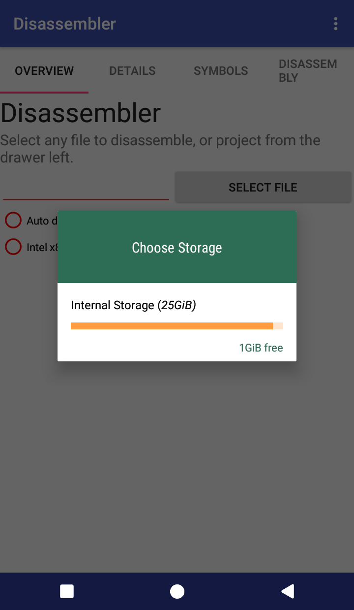
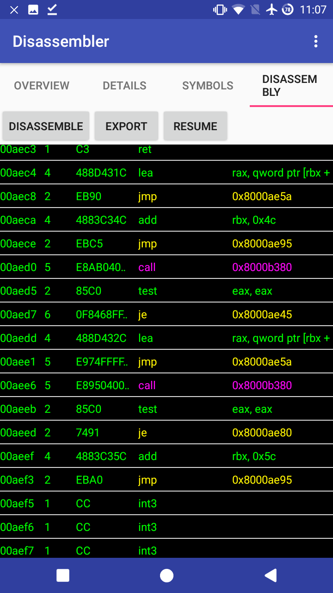

# Version 1.3.1 [release](https://github.com/KYHSGeekCode/Android-Disassembler/releases)!

# Android-Disassembler
Disassemble **ANY** files including android shared libraries (aka .so files) (NDK, JNI), windows PE files(EXE, DLLs, SYSs, etc..), linux executables, object files, ANY files you want like pictures, audios, etc(for fun) entirely on Android. Capstone-based disassembler application on android.

# Features
- Shows details of elf files.
- Shows symbol table(functions or objects' ,... names) of elf files.
- Disassembles the code sections.
- Has various export options of the disassembly. (Reloadable raw file, compilable txt file, analytic text files, json, and  reloadable database)
- Supports projects.
- Supports **directly launching from file browsers**.
- Supports many ABIs(arm,x86,x64,MIPS,PowerPC,...)
- Jump to address by symbols' names, or a hex address.

# What's new
 - Syntax colorizing.
 - Support PE and other bin formats.
 
# Usuage
1. Choose a file to analyze.

1. Go to details tab.
1. Press `Show details` button to see details.

1. Press `Save to file` button to save it.
1. Go to Symbols tab.
1. You can see symbols found in the elf file, their demangled names(if they exist), addresses, and their properties.

1. Go to disassembly tab.
1. Press `disassemble` button.
1. Choose persist mode(instant mode is deprecated)

1. To export the disassembly, press `Export` button and choose the option.

# Export mode
 - Raw
Uses java's intrinsic serialization, and super fast.
 - Classic
Pretty!
 - Simple
Can be directly pasted as code!
 - Json
It can be loaded again to analyze again(though reloading is not implemented yet - Sorry.)
 - Database
Slow. Not recommended.

# Materials about assemblies
 - [ARM](https://www.google.co.kr/url?sa=t&source=web&rct=j&url=http://arantxa.ii.uam.es/~gdrivera/sed/docs/ARMBook.pdf&ved=2ahUKEwjagIuEzOTeAhXHvLwKHeWcCnYQFjAAegQIBBAB&usg=AOvVaw2WWago0qaeDy06z0pgVR3n)
 - [ARM BlackHat](https://www.google.com/url?q=https://www.blackhat.com/presentations/bh-europe-04/bh-eu-04-dehaas/bh-eu-04-dehaas.pdf&sa=U&ved=2ahUKEwjzg-OCg-3eAhUFT7wKHfXlABIQFjACegQIChAB&usg=AOvVaw0JFoqyycNHnqauD5yO6jIj)
 - [Intel](https://en.m.wikibooks.org/wiki/X86_Assembly)
 - [Wiki](https://github.com/KYHSGeekCode/Android-Disassembler/wiki)

# Build & Pull request
 - Use Android studio.
 - Any improvements are welcomed!

# Open Source
 This app used
 - [Capstone](https://github.com/aquynh/capstone) 
 - [Storage-Chooser](https://github.com/codekidX/storage-chooser)
 - [Colorpickerview](https://github.com/skydoves/ColorPickerView)
 - [Java-binutils](https://github.com/jawi/java-binutils)
 - [PECOFF4J](https://github.com/kichik/pecoff4j).

# TODO
 - fix bugs
 - add menus on clicking disassemblies.
 - Organize spaghetti codes.
 - Show prototypes of NDK/C standard APIs in the symbols tab.
 - More sophisticated coorizing.
 - Generate useful comments
 - Provide assembly tutorials.

# XRefs
https://reverseengineering.stackexchange.com/a/18203/23870