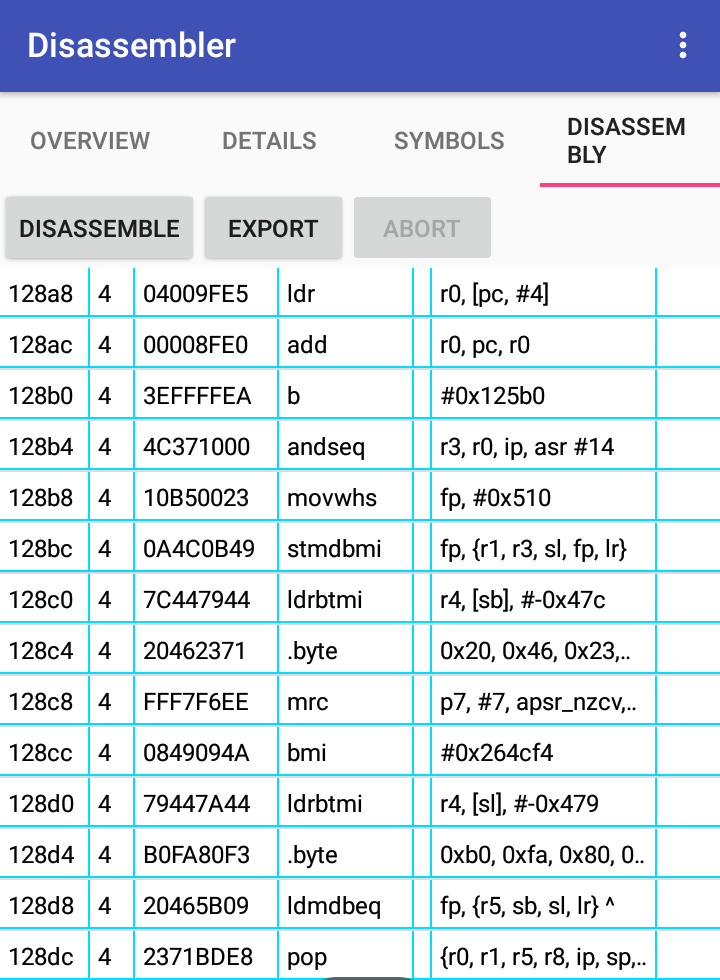

# Version 1.1.2 [release](https://github.com/KYHSGeekCode/Android-Disassembler/releases)!

# Android-Disassembler
Disassemble android shared libraries (aka .so files) (NDK, JNI) on Android. Capstone-based disassembler application on android.

# Features
- Shows details of elf files.
- Shows symbol table(functions or objects' ,... names) of elf files.
- Disassembles the code sections.
- Has various export options of the disassembly. (Reloadable raw file, compilable txt file, analytic text files, json, and  reloadable database)
- Supports projects.
- Supports launching from file browsers.
- Supports many ABIs(arm,x86,x64,MIPS,PowerPC,...)

# What's new
 - Changed to Android Studio structure.
 - Doesn't require your email accounts when sending error reports
 - Easier bug report
 - Show symbols as an independent tab.
 
# Usuage
1. Choose an elf file to analyze.

1. Go to details tab.
1. Press `Show details` button to see details.

1. Press `Save to file` button to save it.
1. Go to Symbols tab.
1. You can see symbols found in the elf file, their demangled names(if they exist), addresses, and their properties.

1. Go to disassembly tab.
1. Press `disassemble` button.
1. Choose persist mode(instant mode is deprecated)

1. To export the disassembly, press `Export` button and choose the option.

# Export mode
 - Raw
Uses java's intrinsic serialization, and super fast.
 - Classic
Pretty!
 - Simple
Can be directly pasted as code!
 - Json
It can be loaded again to analyze again(though reloading is not implemented yet - Sorry.)
 - Database
Slow. Not recommended.

# Build & Pull request
 - Use Android studio.
 - Any improvements are welcomed!

# Open Source
 This app used
 - [Capstone](https://github.com/aquynh/capstone) 
 - [Storage-Chooser](https://github.com/codekidX/storage-chooser)
 - [Colorpickerview](https://github.com/danielnilsson9/color-picker-view)
 - [Java-binutils](https://github.com/jawi/java-binutils)
 - [PECOFF4J](https://github.com/kichik/pecoff4j).

# TODO
 - fix bugs
 - add menus on clicking disassemblies.
 - add Syntax highlighting in disassemblies.
 - Add more project export options(zip, etc..)
 - Support exe files. (Why? I don't know..)
 - Organize spaghetti codes.
 - Add theme preferences.

# XRefs
https://reverseengineering.stackexchange.com/a/18203/23870