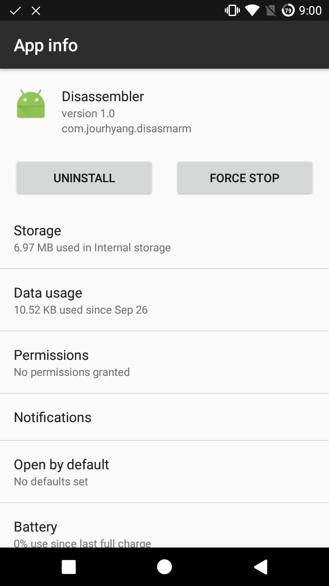
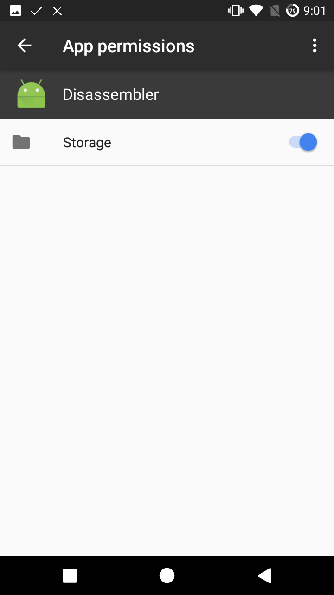
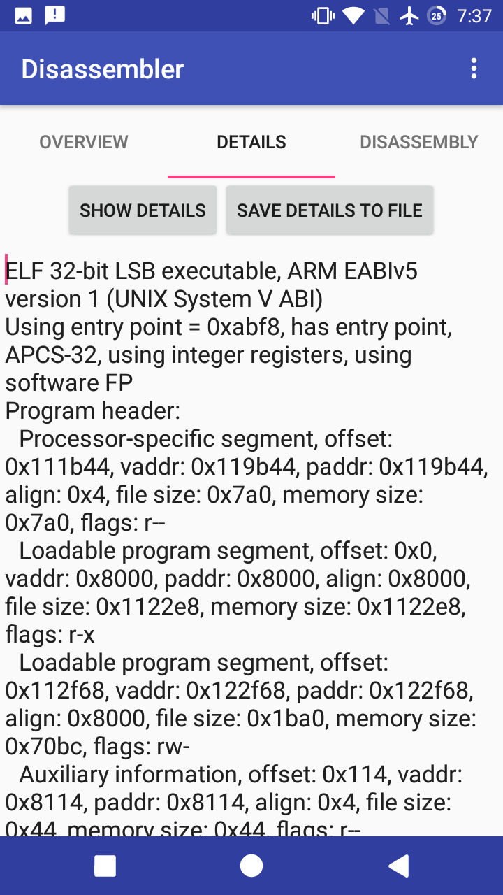

# Android-Disassembler
Disassemble .so (NDK, JNI) files on Android. Capstone-based disassembler application on android

# Features
- Shows details of elf files.
- Disassembles the entire code sections.
- Has various export options of  the disassembly.
- Highlights branch instructions.
- Has Instant analysis mode.

# Usuage
1. Choose an elf file to analyze.
1. Go to details tab.
1. Press `Show details` button to see details.
1. Press `Save to file` button to save it.
1. Go to disassembly tab.
1. Press `disassemble` button.
1. Choose instant mode or persist mode.
1. To export the disassembly, press `Export` button and choose the option.

# Analysis mode
 - Instant mode
Fast and lightweight, but buggy.
 - Persist mode
A bit lags, but OK

# Export mode
 - Classic
Pretty!
 - Simple
Can be directly pasted as code!
 - Json
It can be loaded again to analyze again(though reloading is not implemented yet - Sorry:( )

# Permissions

Before using the app you need some steps:
**Granting permissions**

# ScreenShots

# Build
Use Android studio.

# Open Source
 - This app used [Capstone](https://github.com/aquynh/capstone), [Storage-Chooser](https://github.com/codekidX/storage-chooser), and [Colorpickerview](https://github.com/danielnilsson9/color-picker-view).

# What's new
 - Changed to Android Studio structure.

# TODO
 - Optimization(Done)
 - Support x86 files.
 - fix bugs
 - add menus on clicking disassemblies.
 - add coloring.